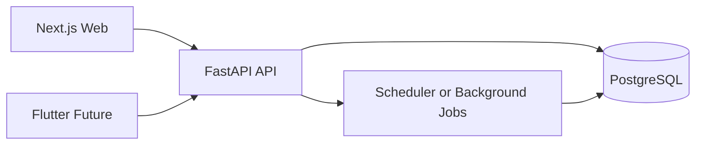
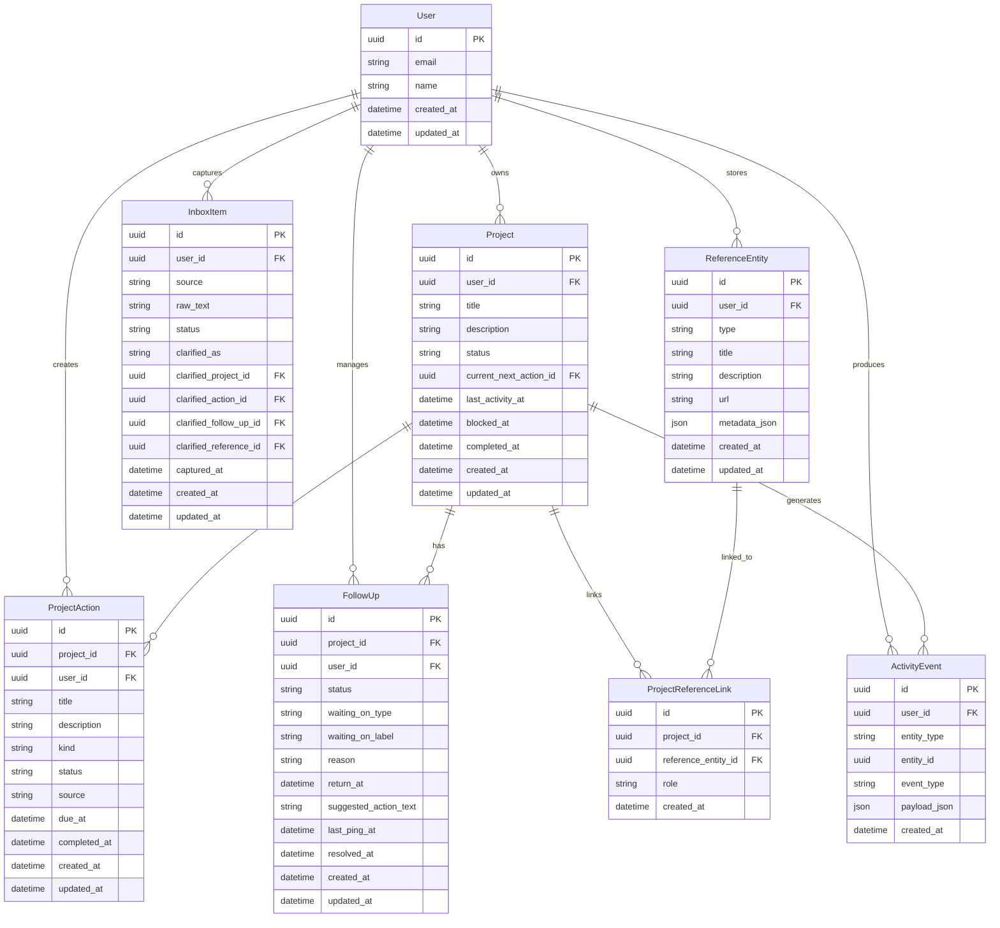

# Архитектура FocusLoop MVP

[Назад в README](./README.md)

## Назначение
Этот документ фиксирует архитектурный каркас MVP для `FocusLoop`: границы системы, основные модули, доменную модель и ключевые правила, на которых строится продукт.

## Контекст системы
Продукт состоит из одного backend и двух клиентских оболочек:

- `Web` на `Next.js` как основной интерфейс для MVP.
- `Mobile` на `Flutter` позже, поверх того же API.
- `Backend` на `FastAPI` как API и доменный слой.
- `PostgreSQL` как основной источник истины.

## Архитектурный подход
Для MVP рекомендуется `modular monolith`.

Почему:

- быстрее собирать и менять продукт;
- проще держать доменную логику в одном месте;
- меньше инфраструктурных рисков;
- легче адаптировать модель по мере product discovery.

## Высокоуровневая схема


## Основные архитектурные принципы
- Бизнес-правила живут в backend, а не размазываются по клиентам.
- `Today` и `Weekly review` отдаются как готовые view-model payloads.
- `Follow-up`, `attention` и `review` считаются first-class концептами, а не побочным эффектом списка задач.
- В MVP не используется тяжелая event-driven инфраструктура.

## Ключевые backend-модули
- `auth`
- `inbox`
- `projects`
- `project_actions`
- `follow_ups`
- `attention`
- `reviews`
- `reference`
- `activity_log`

## Рекомендуемая структура backend
```text
backend/
  app/
    main.py
    api/
      routes/
    core/
      config.py
      security.py
      db.py
    modules/
      inbox/
        models.py
        schemas.py
        service.py
        repository.py
        router.py
      projects/
      project_actions/
      follow_ups/
      attention/
      reviews/
      reference/
      activity_log/
    jobs/
      follow_up_jobs.py
      review_jobs.py
```

## Доменная модель
Основные сущности:

- `User`
- `Project`
- `ProjectAction`
- `InboxItem`
- `FollowUp`
- `ReferenceEntity`
- `ProjectReferenceLink`
- `ActivityEvent`

### Роль сущностей
- `Project` — главный объект работы.
- `ProjectAction` — конкретное действие внутри проекта, включая `next action`.
- `InboxItem` — сырое входящее, которое еще не разобрано.
- `FollowUp` — запись о блокировке и механизме возврата проекта.
- `ReferenceEntity` — люди, команды, сервисы и другие справочные сущности.
- `ProjectReferenceLink` — связь между проектом и справочником.
- `ActivityEvent` — история изменений и основа для review.

## ER-диаграмма


## Бизнес-правила
- Активный проект обязан иметь текущий `next action`.
- Заблокированный проект обязан иметь валидный `follow_up`.
- `Today` строится не из всего списка задач, а из attention states.
- `Weekly review` показывает движение по проектам, блокировки, застой и отсутствие следующего шага.

## Attention model
Основные attention states:

- `Overdue follow-up`
- `Returned today`
- `No next action`
- `Stale project`
- `Recommended next actions`
- `Inbox waiting`

Приоритет:

1. `Overdue follow-up`
2. `Returned today`
3. `No next action`
4. `Stale project`
5. `Recommended next actions`
6. `Inbox waiting`

## Фоновые задачи
Для MVP достаточно легкого scheduler.

Нужны как минимум:

- проверка `follow_ups`, у которых `return_at <= now`;
- поддержка weekly review агрегатов при необходимости.

Не нужны на старте:

- Kafka
- Celery
- event bus
- websocket-инфраструктура

## Frontend-контур
Основной клиент — `Next.js`.

Рекомендации:

- `App Router`
- `TypeScript`
- `TanStack Query`
- простой UI-kit вроде `shadcn/ui`

Пример структуры:

```text
web/
  app/
    today/
    inbox/
    projects/
    review/
  features/
    clarify-inbox/
    block-project/
    complete-next-action/
    weekly-review/
  entities/
    project/
    inbox-item/
    follow-up/
  shared/
    ui/
    api/
    lib/
```

## Ограничения MVP
Входит:

- inbox
- projects
- next actions
- blocked follow-ups
- today attention view
- weekly review
- reference entities
- activity log

Не входит:

- командная работа
- realtime
- сложные интеграции
- AI-функции
- продвинутая аналитика
- тяжелая инфраструктура

## Архитектурный вывод
Стартовый рекомендуемый вариант:

- `FastAPI` modular monolith
- `PostgreSQL`
- `Next.js` как основной клиент
- `Flutter` позже поверх того же API
- доменная логика в backend-модулях
- `attention`, `review` и `follow_up` как ключевые понятия продукта
