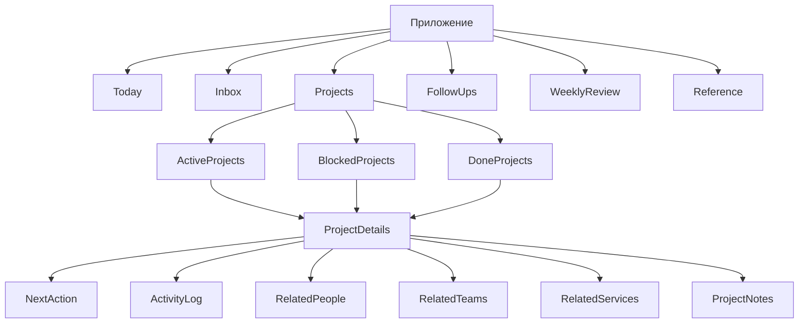

# FocusLoop MVP

`FocusLoop` — это персональная productivity-система для перегруженных knowledge workers. Продукт не является обычным списком задач: он строится вокруг цикла `capture -> clarify -> do -> review`.

## Навигация по документации
- [Архитектура](./ARCHITECTURE.md)
- [REST API контракт](./API.md)
- [IA и навигация](./docs/ui-ux/01-ia-navigation.md)
- [Core user flows](./docs/ui-ux/02-core-user-flows.md)
- [Critical screen wireframes](./docs/ui-ux/03-critical-screen-wireframes.md)
- [States and attention rules](./docs/ui-ux/04-states-and-attention-rules.md)
- [Web low-fi prototype](./docs/ui-ux/05-lowfi-prototype.html)
- [Mobile low-fi prototype](./docs/ui-ux/06-mobile-lowfi-prototype.html)
- [Mobile UX spec](./docs/ui-ux/07-mobile-ux-spec.md)
- [Team guidelines](./docs/process/TEAM_GUIDELINES.md)
- [Git guide](./docs/process/GIT_GUIDE.md)
- [Development workflow](./docs/process/DEVELOPMENT_WORKFLOW.md)
- [Code review checklist](./docs/process/CODE_REVIEW_CHECKLIST.md)
- [Task template](./docs/process/TASK_TEMPLATE.md)
- [PR template](./docs/process/PR_TEMPLATE.md)
- [Scrum master guidelines](./docs/process/SCRUM_MASTER_GUIDELINES.md)

## Цель продукта
Помочь пользователю:

- фиксировать входящие обязательства и идеи;
- разбирать их в проекты, следующие шаги, follow-up'ы и справочные сущности;
- держать каждый активный проект в движении за счет понятного `next action`;
- не терять заблокированную работу, а возвращать ее в нужный момент;
- смотреть на прогресс по проектам на недельном обзоре.

## Продуктовые принципы
- `Project-first`: основной объект интерфейса — проект, а не плоский список задач.
- `Always next action`: у каждого активного проекта должен быть один текущий следующий шаг.
- `Blocked is not lost`: заблокированные проекты исчезают из операционного фокуса, но автоматически возвращаются по дате.
- `Review over backlog`: домашний экран — это поверхность внимания, а не свалка из всех задач.
- `One product, two shells`: веб и мобильный клиент разделяют одну ментальную модель и один backend.

## Основные пользовательские сценарии
1. `Today`: понять, что требует внимания прямо сейчас.
2. `Inbox clarify`: превратить сырое входящее в структурированную работу.
3. `Project work`: завершить или заменить текущий `next action`.
4. `Blocked follow-up`: безопасно поставить проект на ожидание и вернуть позже.
5. `Weekly review`: увидеть прогресс, блокировки и застой по проектам.

## Информационная архитектура
- `Today`
- `Inbox`
- `Projects`
- `Follow-ups`
- `Weekly review`
- `Reference`

## UX-правила
- Не делать плоский список задач основным рабочим экраном.
- Не смешивать `active` и `blocked` проекты без явного фильтра.
- Всегда объяснять, почему элемент показан на `Today`.
- Показывать только несколько рекомендуемых действий, а не весь бэклог.

## Attention states
- `Overdue follow-up`
- `Returned today`
- `No next action`
- `Stale project`
- `Recommended next actions`
- `Inbox waiting`

Приоритет внимания:

1. `Overdue follow-up`
2. `Returned today`
3. `No next action`
4. `Stale project`
5. `Recommended next actions`
6. `Inbox waiting`

## Выбранный стек
- `Backend`: FastAPI
- `Web`: Next.js
- `Database`: PostgreSQL
- `ORM / миграции`: SQLAlchemy + Alembic
- `Web data fetching`: TanStack Query
- `UI acceleration`: shadcn/ui или похожий UI-kit
- `Mobile`: Flutter + SQLite
- `Jobs`: легкий scheduler / cron для due follow-up'ов и review-логики

## Документация
- [Архитектура](./ARCHITECTURE.md)
- [REST API контракт](./API.md)

## Процесс команды
- [Team guidelines](./docs/process/TEAM_GUIDELINES.md)
- [Git guide](./docs/process/GIT_GUIDE.md)
- [Development workflow](./docs/process/DEVELOPMENT_WORKFLOW.md)
- [Code review checklist](./docs/process/CODE_REVIEW_CHECKLIST.md)
- [Task template](./docs/process/TASK_TEMPLATE.md)
- [PR template](./docs/process/PR_TEMPLATE.md)
- [Scrum master guidelines](./docs/process/SCRUM_MASTER_GUIDELINES.md)

## Дизайн-артефакты
- [IA и навигация](./docs/ui-ux/01-ia-navigation.md)
- [Core user flows](./docs/ui-ux/02-core-user-flows.md)
- [Critical screen wireframes](./docs/ui-ux/03-critical-screen-wireframes.md)
- [States and attention rules](./docs/ui-ux/04-states-and-attention-rules.md)
- [Web low-fi prototype](./docs/ui-ux/05-lowfi-prototype.html)
- [Mobile low-fi prototype](./docs/ui-ux/06-mobile-lowfi-prototype.html)
- [Mobile UX spec](./docs/ui-ux/07-mobile-ux-spec.md)

## Объем MVP
Входит:

- inbox
- projects
- next actions
- blocked follow-ups
- today attention view
- weekly review
- reference entities
- activity log

Не входит:

- командная работа
- realtime
- продвинутая аналитика
- сложные интеграции
- AI-функции
- тяжелая инфраструктура
