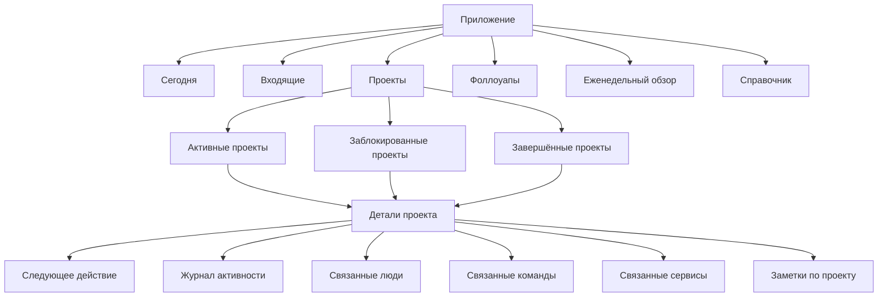

# Информационная архитектура и навигация

[Назад в README](../../README.md)

## Форма продукта
Продукт представляет собой единую персональную систему управления рабочими процессами с двумя оболочками:

- `Web`: основное насыщенное рабочее пространство для обзора, планирования и просмотра нескольких проектов.
- `Mobile`: быстрый компаньон для выполнения задач и захвата информации, предназначенный для коротких обновлений, фоллоуапов и облегчённых обзоров.

Обе оболочки используют одну и ту же ментальную модель:

- система строится вокруг проектов;
- у каждого активного проекта должно быть следующее действие;
- заблокированные проекты уходят из основной зоны фокуса, но автоматически возвращаются в нужную дату;
- стартовый экран является управляемой поверхностью внимания, а не сырым бэклогом.

## Иерархия основных сущностей

## Основная модель навигации
### Общие разделы верхнего уровня
- `Сегодня`
- `Входящие`
- `Проекты`
- `Фоллоуапы`
- `Еженедельный обзор`
- `Справочник`

### Зачем существуют эти разделы
- `Сегодня`: отвечает на вопрос «что требует моего внимания прямо сейчас?»
- `Входящие`: отвечает на вопрос «что поступило и всё ещё требует уточнения?»
- `Проекты`: отвечает на вопрос «что я двигаю, что заблокировано, что завершено?»
- `Фоллоуапы`: отвечает на вопрос «где нужно напомнить о себе или что вернулось из ожидания?»
- `Еженедельный обзор`: отвечает на вопрос «какой прогресс я сделал по проектам?»
- `Справочник`: отвечает на вопрос «кто и что связано с моей работой?»

## Навигация в вебе
### Макет
- Левая панель для основной навигации.
- Основная область контента для списков, досок и обзорных секций.
- Правая контекстная панель для быстрых деталей и действий, когда активен режим разделённого экрана.

### Содержимое левой панели
- Логотип / область переключения продукта
- `Сегодня`
- `Входящие`
- `Проекты`
- `Фоллоуапы`
- `Еженедельный обзор`
- `Справочник`
- Настройки внизу

### Постоянные действия
- Кнопка `Быстрый захват`, закреплённая в верхней части панели
- глобальный поиск / вызов команд в заголовке

### Правила режима разделённого экрана
- `Входящие`: список слева, панель уточнения справа
- `Проекты`: список проектов слева, сводка по проекту справа
- `Еженедельный обзор`: недельные секции слева, краткая сводка по проекту справа

### Плотность информации в вебе
- По умолчанию использовать средне-высокую плотность
- Предпочитать таблицы/карточки с сильными заголовками и короткой вторичной метаинформацией
- В каждом контексте контента оставлять видимым только одно основное действие

## Навигация на мобильном
### Нижняя навигация
- `Сегодня`
- `Входящие`
- `Проекты`
- `Обзор`
- `Ещё`

### Плавающая кнопка действия
- Глобальный `Захват` с любого экрана верхнего уровня

### Что входит в `Ещё`
- `Справочник`
- История активности
- Настройки
- Архивные или завершённые представления при необходимости

### Правила мобильной иерархии
- Детали всегда открываются на весь экран
- Для быстрых действий в потоках редактирования используются нижние шторки, а для многошагового редактирования - полноэкранные формы
- Потоки обзора остаются линейными и сфокусированными на задаче

## Соответствие между платформами
| Концепт | Web | Mobile |
| --- | --- | --- |
| Ежедневное внимание | дашборд `Сегодня` с несколькими панелями | лента `Сегодня` с секциями, расположенными друг под другом |
| Уточнение входящих | режим разделённого экрана | поток по одной карточке за раз |
| Просмотр проектов | список + панель деталей | сегментированный список, затем экран деталей |
| Блокировка проекта | боковая панель | нижняя шторка или полноэкранная панель |
| Еженедельный обзор | обзорный канвас | секции обзора в стиле мастера |

## Правила входа на экраны
### Экран по умолчанию
- Открывать `Сегодня`
- Если есть просроченные фоллоуапы, сначала подсвечивать этот раздел
- Если нет активных проектов со следующим действием, показывать карточку вмешательства

### Приоритеты глубоких ссылок
- уведомления открывают точный проект или элемент фоллоуапа
- подсказки обзора открывают соответствующий шаг обзора, а не просто общий домашний экран

## Ограничения IA
- Не выводить огромный плоский список задач как первоклассный раздел
- Не объединять `активные` и `заблокированные` проекты без явной фильтрации
- Не делать `Справочник` обязательным ежедневным рабочим пространством; он должен поддерживать проекты, а не конкурировать с ними
- Не скрывать причину, по которой что-то требует внимания

## Критерии успеха
- Пользователь без обучения понимает, куда идти для захвата, планирования, выполнения и обзора
- Подписи в вебе и на мобильном совпадают и усиливают одну и ту же ментальную модель
- Первый экран объясняет сегодняшнюю зону внимания, а не всю базу данных
